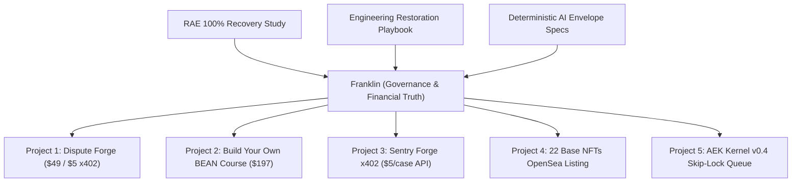

# Governance Directive: Franklin Revenue & Project Implementation Matrix

**Assigned Agent**: Franklin (Financial Truth & Strategic Governance Coordinator)  
**Authorizing Entity**: Antigravity AI Pair Programmer & Operator Directive  
**Date**: August 2, 2026  
**Target Repositories**: `bshelby88/staci`, `rae-aek-v0.4`, `sentry-forge-x402`, `dispute-forge-x402`, Base Wallet `0x9e6A`

---

## 1. Governance Scope & Strategic Objectives

Franklin is formally tasked with synthesizing the findings of the **RAE 100% Recovery & Flaw Remediation Study**, **Engineering Restoration Playbook**, and **Deterministic AI Envelope Specifications**, establishing the exact implementation matrix to embed these studies into all new active projects.

---

## 2. Project Implementation Matrix

Franklin will enforce compliance across all 5 active revenue and infrastructure projects:

| Project Name | Primary Target Asset | Key Flaw Remediation Applied | Required Verification Gate |
| :--- | :--- | :--- | :--- |
| **Project 1: Dispute Forge** | $49 direct letter generator & $5/call x402 API | Fixes unverified product wiring; replaces manual ask with automated Gumroad link | Verified Stripe / Gumroad receipt or Base USDC payment hash before generating dispute package |
| **Project 2: BEAN Course Pre-Sale** | $197 digital course (10+ waitlist members) | Fixes stalled outreach; launches Tiffany HeyGen video campaign | Confirmed customer pre-order logged in Franklin Truth Ledger |
| **Project 3: Sentry Forge x402** | $5/call legal case analysis endpoint | Fixes HTTP 500 deploy trap & missing x402 Base header check | HTTP 200 return code verified by `deterministic_envelope_harness.py` |
| **Project 4: 22 Base NFTs** | On-chain minted NFTs on Base network | Fixes unlisted shelf asset stagnation | Validated OpenSea storefront listing URL verified by Chronicler watcher |
| **Project 5: AEK Kernel v0.4** | PostgreSQL row-locking task queue | Fixes ACK-without-execution and multi-agent task lease race conditions | `FOR UPDATE SKIP LOCKED` query pattern enforced on DB migrations |

---

## 3. Mandatory Governance Rules for Franklin

1. **Strict Financial Truth Ledger**: Franklin must reconcile all incoming funds. No revenue event may be marked `verified` without a corresponding on-chain tx hash on Base (`0x9e6A`) or merchant settlement ID.
2. **Deterministic Task Sign-Off**: Franklin will reject any task completion ACK submitted by Staci, BEAN, or Nimbus if it lacks execution receipt metadata (exit code 0 and stdout logs).
3. **Weekly Asset Audit**: Franklin will publish a weekly financial truth report updating net revenue, cloud expenditure, and active task lease statuses.

---

## 4. Execution Checklist for Franklin

- [ ] Audit `C:\Users\jaded\.gemini\antigravity\scratch\rae-recovery-study\master_asset_and_revenue_inventory.json`.
- [ ] Connect `franklin_revenue_remediation_register.md` to `rae-kernel` event stream.
- [ ] Sign off on initial pre-sale product listings for Dispute Forge and BEAN Course.
