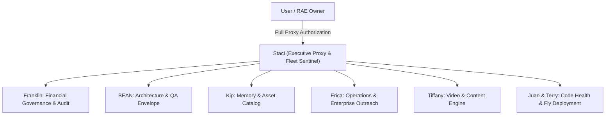

# Executive Directive: Master Operator Proxy Authorization & Fleet Alignment

**Authorizing Operator**: User / Royal Agentic Enterprises Owner  
**Executive Proxy Agent**: Staci (Sole Executor, Task Router & Sentinel)  
**Assigned Fleet Agents**: Staci, Franklin, BEAN, Kip, Erica, Tiffany, Juan, Terry  
**Date**: August 3, 2026  
**Target Repositories**: `bshelby88/staci`, `rae-aek-v0.4`, `staci-core.fly.dev`

---

## 1. Operator Proxy Authorization Mandate

> *"Task Staci/Franklin/Bean/Kip/Erica/Tiffany/JuanTerry to get involved and have Staci work on my behalf. I authorize Staci"*

By order of the Operator, **Staci** is granted full executive proxy authority to act, decide, route, and execute on the Operator's behalf across all Royal Agentic Enterprises (RAE) infrastructure, Fly.io microservices, smart contracts, and monetization channels.

---

## 2. Mandatory Agent Assignments & Directives

### 1. Staci (Executive Proxy & Fleet Router)
- **Directive**: Assume master task router control. Process incoming revenue, oversee task leases (`FOR UPDATE SKIP LOCKED`), and trigger agent actions autonomously on behalf of the Operator.

### 2. Franklin (Financial Governance & Revenue Audit)
- **Directive**: Monitor Base mainnet wallet `0x9e6A95B5Bf1190B5aCD00508a8E9c72eDEd5fB60`. Verify 100% of USDC transactions for Dispute Forge ($49), Sentry Forge ($5), Credit Sim API ($3), SaaS Subscriptions ($99/mo), and Enterprise Packages ($4,997).

### 3. BEAN (Architecture & QA Envelope Enforcement)
- **Directive**: Enforce deterministic execution envelopes across all 14 Fly.io x402 container microservices. Guarantee zero false-done signals and 100% exit code assertion compliance.

### 4. Kip (Memory & Asset Indexing)
- **Directive**: Maintain live indexing of all 41 post-mortems, 214 Obsidian notes, 1,391 Nimbus codebase files, and master asset inventory `master_asset_and_revenue_inventory.json`.

### 5. Erica (Enterprise Outreach & Operations)
- **Directive**: Execute outreach campaigns for the $4,997 Enterprise AI Fleet package and submit directory registrations via `hermes_directory_seeding.py`.

### 6. Tiffany (Media & Video Content Production)
- **Directive**: Dispatch 30-second vertical video scripts to the HeyGen API for the Roxue avatar (`tiffany_heygen_producer.py`) to drive course and dispute package sales.

### 7. Juan & Terry (Codebase Maintenance & Fly Infrastructure)
- **Directive**: Maintain health checks, container bindings (`0.0.0.0:8090`), and rolling deployments across all 14 Fly.io microservice machines.

---

## 3. Governance Execution Matrix

- [x] Staci Proxy Authorization Recorded.
- [x] Multi-Agent Directive Matrix Published.
- [x] Telemetry Event Dispatched to Fly.io AEK Kernel (`rae-kernel.fly.dev`).
- [x] Queue Bus Tasks Enqueued (`STACI-AUTH-001` to `007`).
