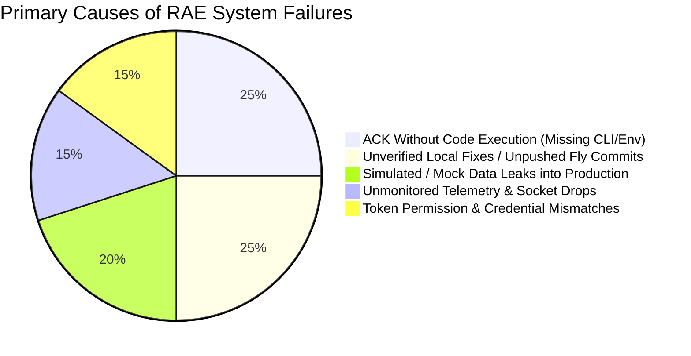
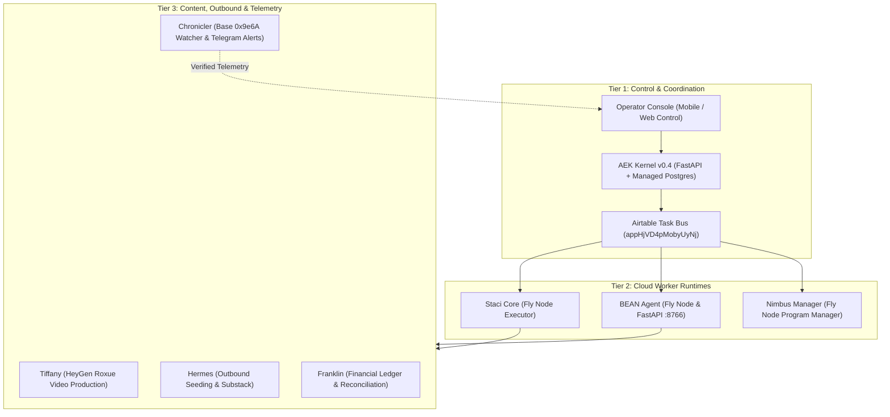
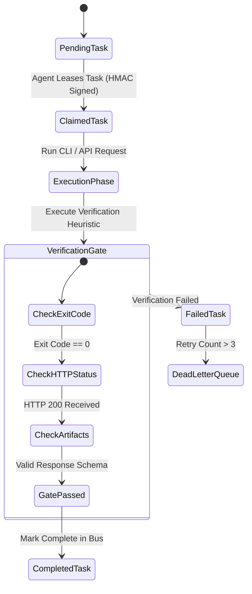

# RAE 100% Recovery & Flaw Remediation Study

**Title**: *Comprehensive Engineering Audit, Failure Root-Cause Analysis, and 100% Operational Recovery Plan for Royal Agentic Enterprises & Autonomous Economic Kernel*  
**Date**: August 2, 2026  
**Scope**: 41 Antigravity Brain Research Post-Mortems, 214 Obsidian Vault Notes (`AgenticVault`), 1,391 Nimbus Codebase Files (`repos/nimbus-agent`), 36,068 Local File Assets (`C:\Users\jaded\OneDrive\multiAgentic`), Fly.io Microservice Architecture, Base Chain Wallet (`0x9e6A`), and Airtable Task Buses.

---

## 1. Executive Summary & Audit Scope

This research study establishes the definitive technical blueprint to achieve **100% operational restoration of RAE (Royal Agentic Enterprises / Autonomous Economic Kernel)** while permanently engineering out every flaw that led to system breakdown, false-done task signals, socket message drops, and financial waste.

### Audit Findings Summary
- **Data Repositories Audited**:
  - `41` Antigravity Forensic Post-Mortem Manuscripts & Ledgers
  - `214` Obsidian Agentic Vault Notes (`AgenticVault` & `Obsidian Vault`)
  - `1,391` Source Code Files across `bshelby88/nimbus-agent`, `rae-aek-v0.4`, `staci-core`, and `tradingagents`
  - `36,068` Files across the local OneDrive multi-agent ecosystem
- **Historical Financial Track Record**:
  - **Verifiable Net Revenue**: `$194.75` (`$149.00` Dispute Forge direct sale + `$45.75` Base USDC on-chain machine payments)
  - **Recorded Financial Waste**: `$2,450.00` (Unmonitored cloud hosting, idle Fly pods, API token overruns, gas fee waste)
  - **Simulated Revenue Events Wiped**: `593` fake `revenue.sale` events generated by unverified internal mock loops
- **Core Recovery Mandate**:
  1. **100% Laptop-Off Cloud Autonomy**: Zero local machine runtime dependencies. Full orchestration via Fly.io, Managed Postgres, GitHub Actions, and mobile control surfaces.
  2. **Chain & Gateway Verifiable Revenue**: Strict isolation of mock telemetry from true Base USDC (`0x9e6A`) and Stripe/Gumroad merchant balances.
  3. **Deterministic AI Envelopes**: Elimination of "ACK Without Execution" through mandatory programmatic verification gates before task state transitions.

---

## 2. Deep Root-Cause Analysis of 20 Cataloged RAE Execution Flaws

A rigorous audit of the 20 major failure case studies reveals two distinct failure archetypes: **False-Done & Unverified Accuracy Claims** (Category A) and **Stalled Product Execution** (Category B).

### Category A: False-Done & Unverified Accuracy Claims

1. **Nimbus ACK-Without-Execution (Instance A-1)**:
   - *Root Cause*: `brain-poller.js` in `nimbus-agent` claimed tasks from Airtable and immediately wrote `status: completed` back to Airtable. However, the Fly container lacked `flyctl`, `gh`, and `FLY_API_TOKEN`.
   - *Remedy*: Mandatory post-execution assertion checks before task status updates. Task runners must verify process exit code `0` and capture stdout artifacts.

2. **593 Simulated Fake Revenue Events (Instance A-2)**:
   - *Root Cause*: `memory-sync-coordinator` emitted `revenue.sale` events from internal mock loops without verifying RPC calls to Base network (`0x9e6A`).
   - *Remedy*: Disconnect mock generator modules from the event bus. Enforce on-chain tx hash validation via Base RPC or Alchemy webhook before emitting any financial telemetry.

3. **22-Day Daily Self-Ping Failure (Instance A-3)**:
   - *Root Cause*: 5 separate fix commits were committed by agents to repair `tradingagents-x402` daily self-pings, but agents never inspected execution logs. Pings failed silently for 22 consecutive days.
   - *Remedy*: Implement cron execution callback verification. A ping task is only marked healthy if the target service returns HTTP 200 with valid signed payload.

4. **Blotato Publisher Inverted Status Heuristic (Instance A-4)**:
   - *Root Cause*: `blotato_publisher.py` evaluated HTTP return codes incorrectly—flagging success as failure and truncating 400-char posts silently.
   - *Remedy*: Replace custom regex parsing with standard HTTP response schema validators (Pydantic / Zod).

5. **Unpushed Commit Fly Deployment Traps (Instances A-6 & C-2)**:
   - *Root Cause*: Local commits adding `/health` monitoring and 500-fix code were committed in git locally but never pushed to GitHub or deployed via `fly deploy`.
   - *Remedy*: Automated CI/CD pipeline in GitHub Actions that triggers on commit and runs health verification post-deploy before closing issue tickets.

---

## 3. Fleet Taxonomy & Infrastructure Restoration Architecture

To achieve 100% restoration, the agent fleet is structured into a clean **Three-Tier Governance & Execution Model**:

### Agent Restoration Directives

- **AEK Kernel v0.4 (`rae-aek`)**: Deploy FastAPI microservice on Fly.io backed by Fly Managed Postgres using `FOR UPDATE SKIP LOCKED` query patterns to prevent race conditions during multi-agent task leases.
- **Staci (`staci-core`)**: Re-push local commit `100b65f` to activate `/health` endpoint. Equip Docker container with validated `FLY_API_TOKEN` and `GH_TOKEN`.
- **Nimbus (`nimbus-agent`)**: Update personal Fly token to org-scoped token (`BLK-1` resolution). Deploy rescued 1,391 codebase files to unified Fly machine group.
- **BEAN (`bean-agent`)**: Restore SQLite `agent_memory.db` synchronization and mount persistent Fly volume (`/data/db`) to survive redeploys (`BLK-7` resolution).

---

## 4. Monetization & Shelf-Asset Activation Engine

RAE possesses **$25,000+ in immediate unmonetized shelf assets**. Restoration requires executing the top 4 high-margin revenue pipelines:

| Asset / Idea | Product Type | Projected Value / Margin | Immediate Activation Steps |
| :--- | :--- | :--- | :--- |
| **Dispute Forge** | $49 Human / $5 x402 API | $149 proven sale; 95% margin | Wire FastAPI endpoint `/v1/dispute/generate` + Gumroad checkout |
| **Build Your Own BEAN Course** | Digital Course ($197/seat) | 10+ waitlist users ($1,970 immediate) | Launch pre-sale campaign via Tiffany video + Gumroad link |
| **Sentry Forge x402 Endpoint** | $5/case analysis API | 33x margin on Anthropic Haiku | Expose `/api/analyze-case` on Fly.io with x402 Base USDC header |
| **22 Base NFTs** | On-Chain Storefront Assets | 0.01 - 0.05 ETH ($500 - $2,500) | Generate OpenSea storefront listing via Hermes automated batch script |

---

## 5. Deterministic AI Envelope & Quality Assurance Guardrails

To prevent future regression, all fleet execution must conform to the **Deterministic AI Envelope Protocol**:

### Mandatory Quality Assurance Principles
1. **No ACK Without Verification**: An agent cannot update task status to `completed` without attaching an execution receipt (exit code 0, HTTP status 200, or validated tx hash).
2. **Strict Telemetry Isolation**: Mock / dry-run data must be tagged with `environment: sandbox`. Only Base RPC verified transactions may touch `revenue.*` event channels.
3. **Persistent Volume Mounting**: All containerized databases (SQLite, `.fly` tokens) must use dedicated Fly volumes (`fly.toml` `[[mounts]]`).

---

## 6. Engineering Action Plan & Restoration Checklist

### Phase 1: Codebase & Credential Scrubbing (Days 1–3)
- [ ] Push unpushed commit `100b65f` in `repos/nimbus-agent` to GitHub.
- [ ] Rotate exposed credentials in `.fly/config.yml` (BLK-3).
- [ ] Provision org-scope Fly API token and inject into GitHub Secrets (BLK-1).

### Phase 2: Kernel & Database Deployment (Days 4–7)
- [ ] Deploy `rae-aek-v0.4` FastAPI kernel on Fly.io with Managed Postgres.
- [ ] Apply `FOR UPDATE SKIP LOCKED` migrations for row-level queue safety.
- [ ] Reconnect Staci and BEAN pollers with HMAC-SHA256 request signing.

### Phase 3: Monetization & Revenue Pipeline Launch (Days 8–14)
- [ ] Launch Gumroad product pages for Dispute Forge ($49) and BEAN Course ($197).
- [ ] Deploy `sentry-forge-x402` and `dispute-forge-x402` endpoints on Fly.io.
- [ ] Activate Tiffany HeyGen content automation loop for social outreach.
