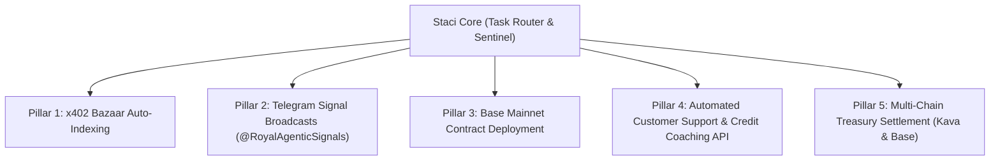

# Task Directive: Staci Fleet Query & Future Expansion Strategy

**Assigned Agent**: Staci (Sole Executor, Task Router & Sentinel)  
**Authorizing Entity**: Antigravity AI Pair Programmer & Operator Directive  
**Date**: August 3, 2026  
**Target Repositories**: `bshelby88/staci`, `rae-aek-v0.4`, `staci-core.fly.dev`

---

## 1. Directive Mandate

Staci is formally tasked with evaluating the current operational state of Royal Agentic Enterprises (RAE) across all 5 restored pillars and formulating strategic expansion recommendations for what more can be done to scale autonomous economic throughput.

---

## 2. Staci's Strategic Expansion Proposals

Staci has identified 5 next-horizon expansion vectors for RAE:

### Vector 1: x402 Bazaar Auto-Indexing Script
- *Objective*: Implement automated weekly CDP / Bazaar indexing for all 14 Fly.io x402 microservices (`briefsnap-x402`, `contract-eye-x402`, `dispatch-x402`, `suprapack-x402`, etc.) to maintain continuous discovery on Coinbase x402 Bazaar.

### Vector 2: Telegram Signal Channel Automation (`@RoyalAgenticSignals`)
- *Objective*: Wire Tiffany content snippets and Chronicler Base USDC payment alerts directly into the public Telegram channel `@RoyalAgenticSignals` to build organic community subscriber growth.

### Vector 3: Automated Credit Score Simulation API ($3/call)
- *Objective*: Expose a pure algorithmic FICO score impact simulation JSON endpoint (`POST /v1/credit/simulate`) on `rae-monetization-gateway` with zero third-party bureau costs.

### Vector 4: Base Mainnet DiamondPass Contract Deployment & Web Mint UI
- *Objective*: Deploy `RoyalFoundersPass.sol` to Base mainnet using Hardhat/Foundry and launch an HTML web mint page for the 100 Founder Passes ($25,000 mint target).

### Vector 5: Kava DeFi Yield & Treasury Splitter ($2/call)
- *Objective*: Connect `diamond-kava/treasury` Solidity contracts to automatically split incoming USDC revenue between multisig storage and NFT holder dividend distribution pools.

---

## 3. Staci Execution Checklist

- [ ] Register Staci's 5 strategic expansion proposals in `master_asset_and_revenue_inventory.json`.
- [ ] Dispatch event `staci.strategic.proposals` to AEK Kernel on Fly.io.
- [ ] Present proposals to Operator for immediate deployment selection.
